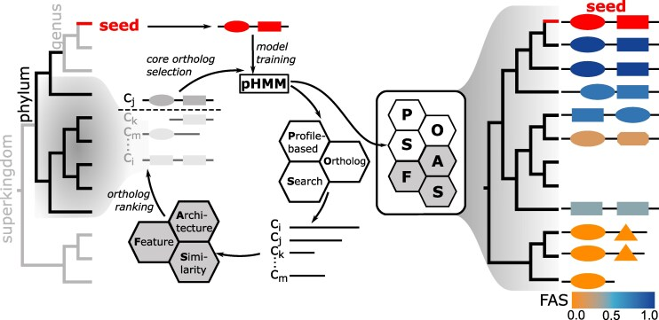

# Introduction to the targeted orthologs search using fDOG

This tutorial is a 2 hours intro into the generation of phylogenetic profiles using a targeted ortholog search. It combines the search for two plant cell wall degrading enzymes in ca. 100 gene sets as well as in two unannotated genome assemblies. The latter requires fDOG-Assembly and it is an optional part of the analysis.

**Figure 1: Workflow of fDOG.** Taken from [Tran et al. 2025](https://pmc.ncbi.nlm.nih.gov/articles/PMC12198962/).

## Software Requirements

* Jupyter Notebook
* Docker

## How to follow this Tutorial

Open the `cellulase_comparison.ipynb` notebook in this directory using Jupyter. It will take you through all steps of this tutorial. 

## Workpackages

1. Download data (15 min)
2. Activate Docker image (10 min)
3. Run fDOG for targeted ortholog search in gene sets (15 min)
4. Access G-NOM (10 min)
5. Upload results to PhyloProfile (15 min)
6. Analyses (60 min)

### Analyses

1. Identify species with deviating enzyme repertoires (15 min)
2. Assess the feature architecture similarity between seed proteins and orthologs (30 min)
3. Assess the taxonomic assignment of candidate orthologs as well as their placement in the genome assembly (15 min)

# Literature

You can find a selected list of publications in the `docs/literature` directory. 

